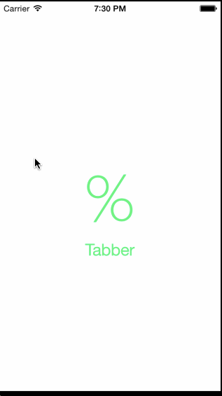

# Tip Calculator - Tabber

This is an iOS application that allows a user to calculate the tip of a bill and divide the bill by up to four people.  This is the prework assignment for CodePath from their [walkthrough](http://vimeo.com/102084767).

Time spent: 6 hours spent in total

Completed stories:

 * [x] Required: User can input bill amount and change tip percentage to calculate tip and total bill amount
 * [x] Optional: Add split bill functionality to up to four people
 * [x] Optional: Add animation and color to UI to show only the input field when it is empty
 * [x] Optional: Add app icon and launchscreen
 * [x] Optional: Use locale specific currency and thousands separators
 
<!-- Notes:

Spent some time making the UI work across multiple phone resolutions by playing around with the RelativeLayout.

Walkthrough of stories:

GIF created with [LiceCap](http://www.cockos.com/licecap/). -->
